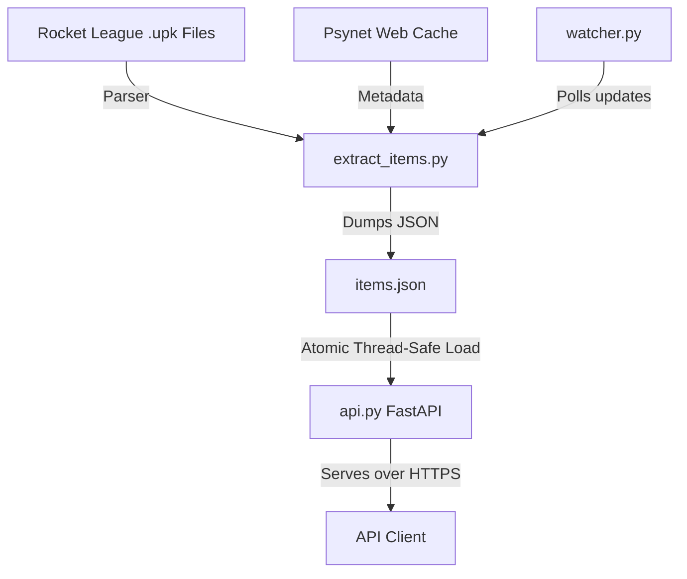

# Architecture

VelocityRL utilizes a highly efficient **Sidecar Architecture** designed for high throughput, atomic data serving, and zero-downtime hot reloads on headless Linux servers.

---

## Technical Components

### 1. The Asset Mapping Engine (`extract_items.py`)
Responsible for scanning Rocket League's Unreal Engine 3 package system (`.upk` files) and parsing localization charts.
* **Core Logic**: Reverses names and tags from the game's binary assets, mapping raw internal names (like `wheel_SoccarBall_SF`) to localized display names (like "Cristiano").
* **Psynet Cache**: Queries and parses Psynet web cache structures to merge additional item tags and overrides.
* **Output Database**: Automatically compiles everything into a single structured database file: `items.json`.

### 2. The Daemon Watcher (`watcher.py`)
A lightweight daemon running in the background to ensure data freshness without introducing latency to live requests.
* **Function**: Monitors game installation directories for binary configuration overrides or updates.
* **Coordination**: When it detects a change, it triggers the extraction process asynchronously and signals the API server to hot-reload.

### 3. High-Performance API Server (`api.py`)
Built on FastAPI and optimized for maximum concurrent throughput.
* **Memory-Atomic Operations**: Rather than hitting a disk database on every request, `api.py` loads `items.json` directly into system memory upon startup.
* **Thread-Safe Hot Reloading**: Employs a thread lock (`_reload_lock`) to coordinate data refreshes. If the database is regenerated, the API reloads the in-memory payload instantly with zero downtime.
* **Asset Synchronization**: If the database `items.json` is missing on boot, the API automatically triggers the mapping engine to generate it synchronously before starting to handle client connections.
