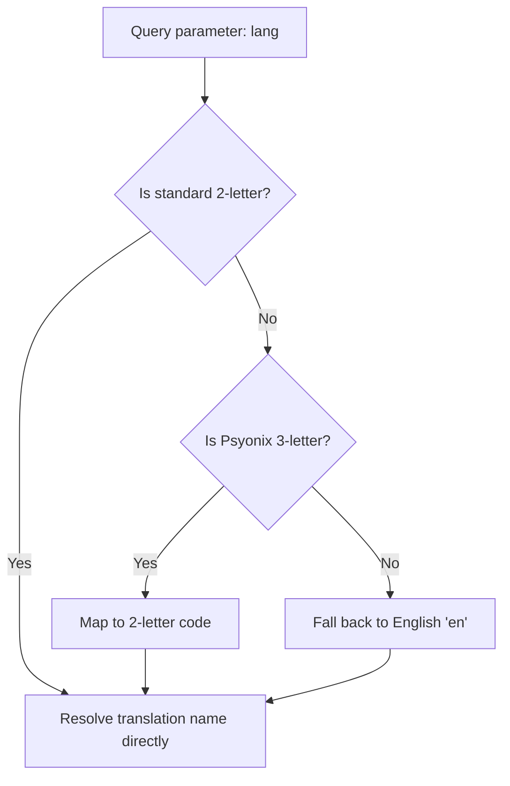

# Localization

VelocityRL supports translation capabilities matching Rocket League's global client distribution. It resolves, caches, and filters dynamic asset translations across **12 official languages** directly inside the API payload.

---

## Language Code Mapping

The API accommodates both standard ISO-639 2-letter codes and Rocket League's internal Psyonix 3-letter (upper or lower case) language designations. 

| Language Name | Standard 2-Letter Key | Psyonix 3-Letter Code | Default Fallback |
| :--- | :---: | :---: | :---: |
| **English** | `en` | `INT` | Yes |
| **Spanish** | `es` | `ESN` | - |
| **French** | `fr` | `FRA` | - |
| **German** | `de` | `DEU` | - |
| **Italian** | `it` | `ITA` | - |
| **Portuguese (Brazilian)** | `pt` | `PTB` | - |
| **Japanese** | `ja` | `JPN` | - |
| **Korean** | `ko` | `KOR` | - |
| **Russian** | `ru` | `RUS` | - |
| **Turkish** | `tr` | `TRK` | - |
| **Dutch** | `nl` | `DUT` | - |
| **Polish** | `pl` | `POL` | - |

---

## Language Resolution Pipeline

When you specify a language query via the `lang` parameter (e.g., `lang=es` or `lang=ESN`), the API executes a safe, fast resolution chain:



1. **Resolution Keying**: If the query matches a standard 2-letter format, it matches instantly. If it matches a Psyonix 3-letter code, it maps it internally.
2. **Atomic Fallback**: If the item does not have a translation in the requested language, or the language code is invalid, the engine falls back to English (`en`) gracefully to ensure a robust response.
3. **Translation Dictionary Pruning**: The database contains complete translations in a nested `translations` dictionary. To minimize bandwidth and optimize client-side parsing, the API removes this full translations block from products endpoints and replaces the root `name` field directly with the resolved localized string.

---

## Query Example

### Fetching a Decal with Spanish (ESN) Localization

```bash
curl -s "https://api.sfdb.dev/v2/rl/products?lang=esn&category=decal&limit=1"
```

#### Localized Response Payload

```json
{
  "meta": {
    "returned": 1,
    "total_filtered": 3173,
    "limit": 1,
    "offset": 0
  },
  "products": [
    {
      "id": 6133,
      "name": "007's Aston Martin DB5: Reel Life",
      "category_id": "decal",
      "category": "Decal",
      "quality_id": 4,
      "quality": "Import",
      "paintable": false,
      "tradable": false,
      "blueprint": false,
      "source": "product_dump",
      "thumbnail_url": null
    }
  ]
}
```
*(Notice that the `name` field returned is translated directly and the nested translations mapping dictionary is automatically pruned. `thumbnail_url` is `null` when no thumbnail has been extracted for that item yet.)*
